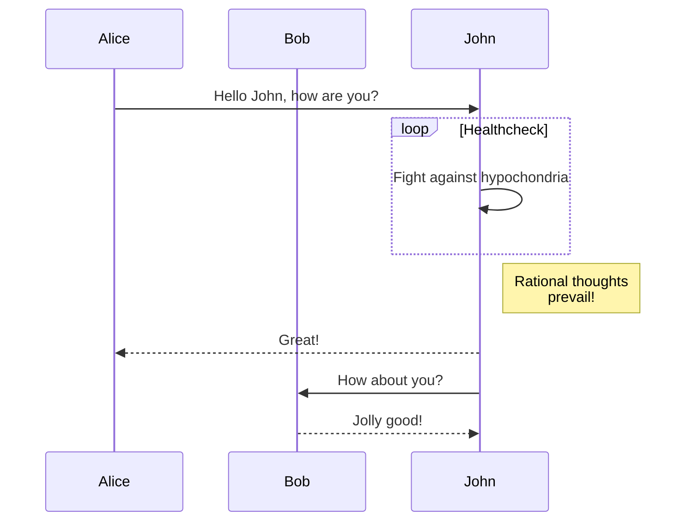

در حال حاضر، Hextra از [Mermaid](#mermaid) برای نمودارها پشتیبانی می‌کند.

<!--more-->

## Mermaid

[Mermaid](https://github.com/mermaid-js/mermaid#readme) یک ابزار نمودار و چارت مبتنی بر جاوااسکریپت است که تعاریف متنی الهام‌گرفته از Markdown را گرفته و به صورت پویا در مرورگر نمودارها را ایجاد می‌کند. به عنوان مثال، Mermaid می‌تواند فلوچارت‌ها، نمودارهای توالی، نمودارهای دایره‌ای و موارد دیگر را رندر کند.

استفاده از Mermaid در Hextra به سادگی نوشتن یک بلوک کد با زبان تنظیم شده `mermaid` است:

````markdown

````

به صورت زیر رندر می‌شود:


نمودار توالی:



برای اطلاعات بیشتر، لطفاً به [مستندات Mermaid](https://mermaid-js.github.io/mermaid/#/) مراجعه کنید.