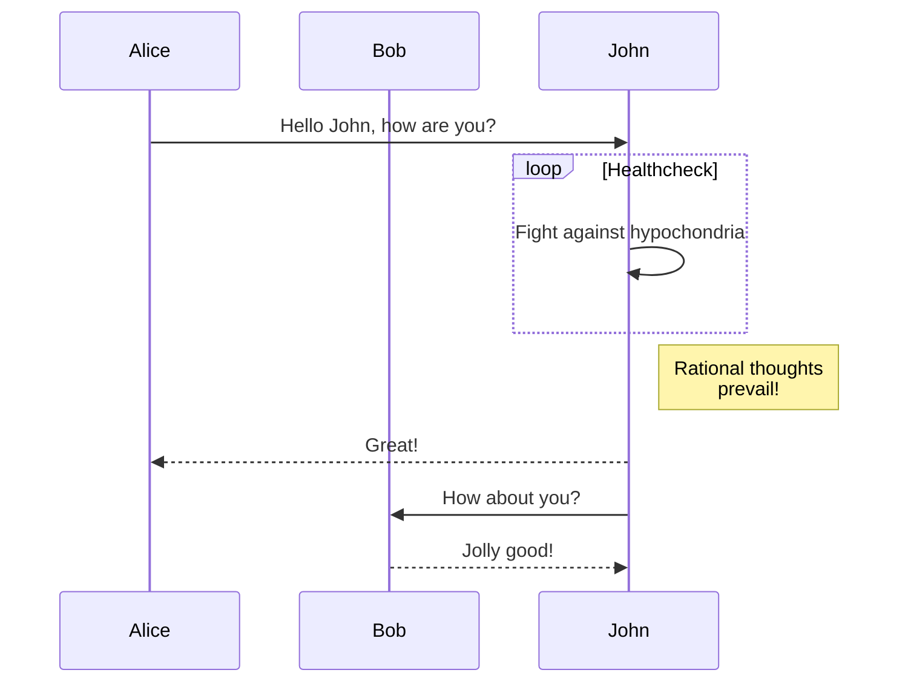

Currently, Hextra supports [Mermaid](#mermaid) for diagrams.

<!--more-->

## Mermaid

[Mermaid](https://github.com/mermaid-js/mermaid#readme) is a JavaScript based diagramming and charting tool that takes Markdown-inspired text definitions and creates diagrams dynamically in the browser. For example, Mermaid can render flow charts, sequence diagrams, pie charts and more.

Using Mermaid in Hextra is as simple as writing a code block with language set `mermaid`:

````markdown

````

will be rendered as:


Sequence diagram:



For more information, please refer to [Mermaid Documentation](https://mermaid-js.github.io/mermaid/#/).
