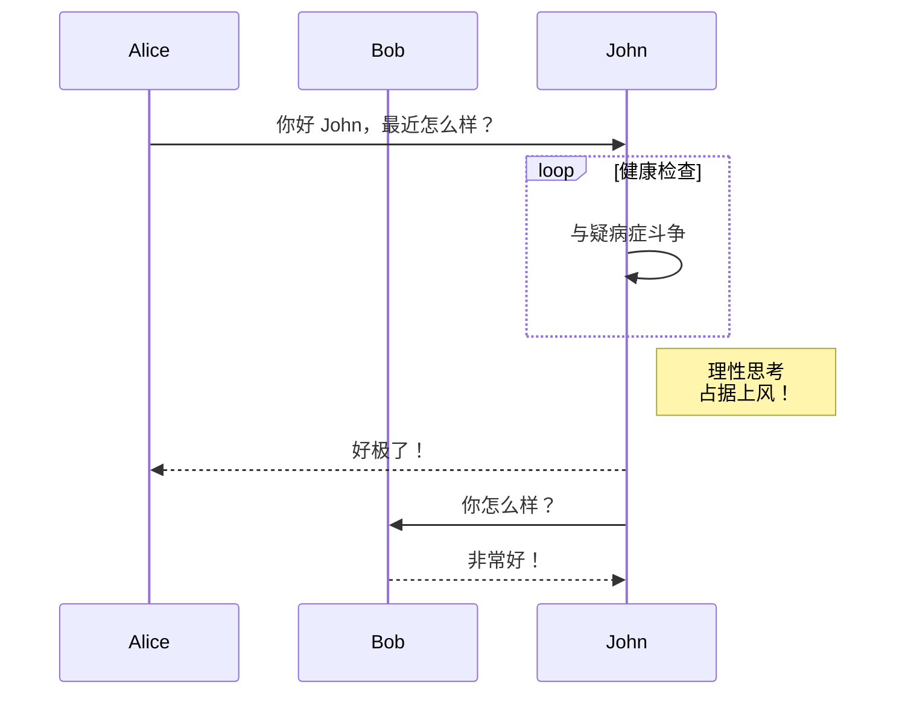

目前，Hextra 支持通过 [Mermaid](#mermaid) 绘制图表。

<!--more-->

## Mermaid

[Mermaid](https://github.com/mermaid-js/mermaid#readme) 是一个基于 JavaScript 的图表绘制工具，它能将类 Markdown 的文本定义动态转换为浏览器中渲染的图表。例如，Mermaid 可以绘制流程图、时序图、饼图等多种图表。

在 Hextra 中使用 Mermaid 非常简单，只需编写一个语言设置为 `mermaid` 的代码块：

````markdown

````

上述代码将渲染为：


时序图示例：



更多信息请参阅 [Mermaid 官方文档](https://mermaid-js.github.io/mermaid/#/)。