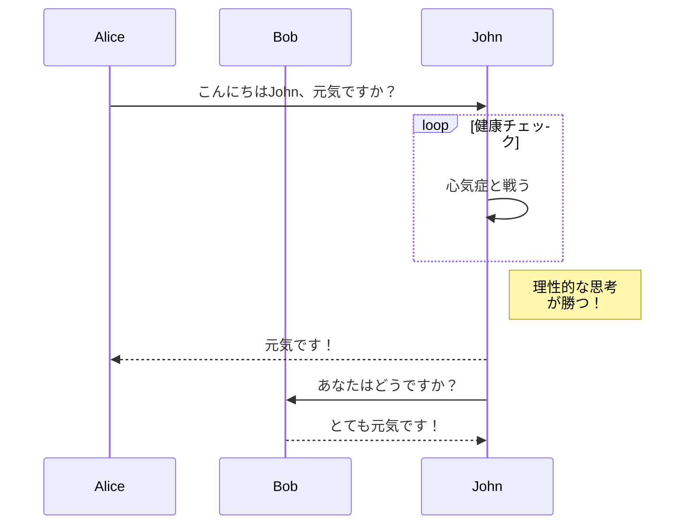

現在、Hextraはダイアグラムのために[Mermaid](#mermaid)をサポートしています。

<!--more-->

## Mermaid

[Mermaid](https://github.com/mermaid-js/mermaid#readme)は、JavaScriptベースのダイアグラムおよびチャート作成ツールで、Markdownにインスパイアされたテキスト定義を取り込み、ブラウザ内でダイナミックにダイアグラムを作成します。例えば、Mermaidはフローチャート、シーケンス図、円グラフなどをレンダリングできます。

HextraでMermaidを使用するのは、言語を`mermaid`に設定したコードブロックを書くのと同じくらい簡単です:

````markdown

````

これは次のようにレンダリングされます:


シーケンス図:



詳細については、[Mermaidドキュメント](https://mermaid-js.github.io/mermaid/#/)を参照してください。