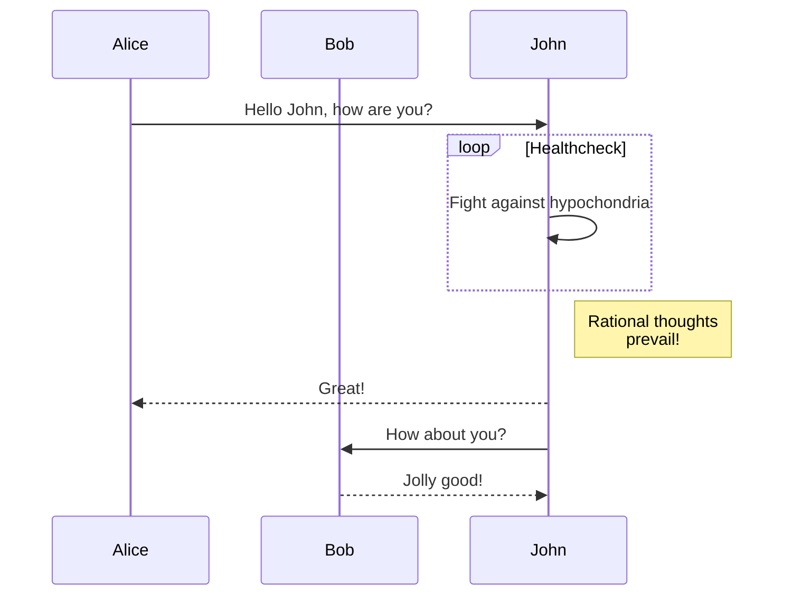

現在、Hextra は [Mermaid](#mermaid) によるダイアグラム作成をサポートしています。

<!--more-->

## Mermaid

[Mermaid](https://github.com/mermaid-js/mermaid#readme) は、JavaScript ベースのダイアグラムおよびチャート作成ツールで、Markdown 風のテキスト定義をブラウザ上で動的にダイアグラムに変換します。例えば、Mermaid はフローチャート、シーケンス図、円グラフなどをレンダリングできます。

Hextra で Mermaid を使用するには、言語を `mermaid` に設定したコードブロックを記述するだけです:

````markdown

````

これは以下のようにレンダリングされます:


シーケンス図の例:



詳細については、[Mermaid ドキュメント](https://mermaid-js.github.io/mermaid/#/)を参照してください。