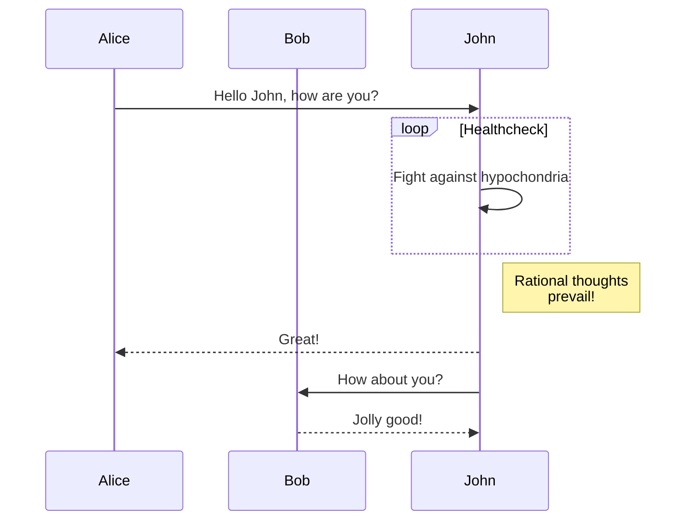

目前，Hextra 支持 [Mermaid](#mermaid) 的图表。

<!--more-->

## Mermaid

[Mermaid](https://github.com/mermaid-js/mermaid#readme) 是一个基于 JavaScript 的图表绘制工具，它的文本定义和 Markdown 类似，可在浏览器中动态创建图表。例如：流程图、序列图、饼图等。

在 Hextra 中使用 Mermaid 就像使用代码块一样简单：

````markdown

````

将呈现为：


Sequence diagram：



如需获取更多信息，转至 [Mermaid Documentation](https://mermaid-js.github.io/mermaid/#/)。
