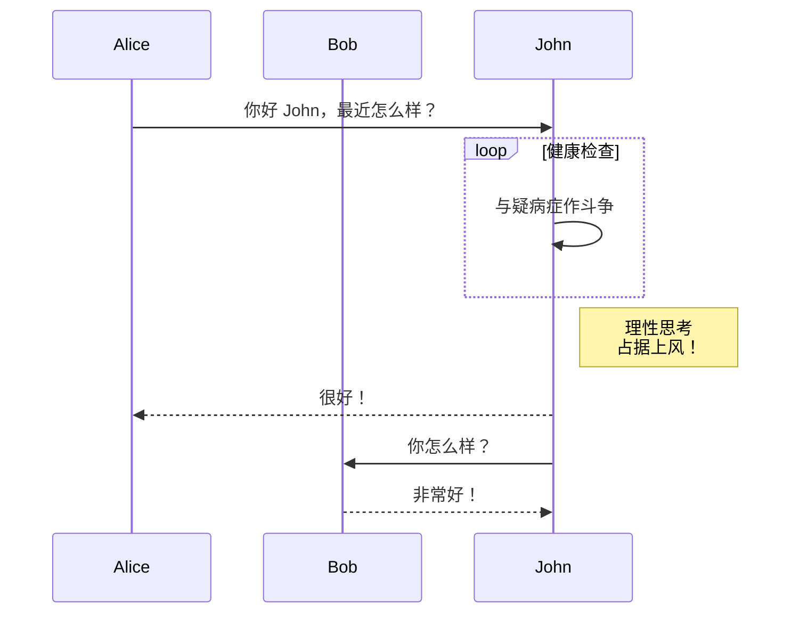

目前，Hextra 支持使用 [Mermaid](#mermaid) 来绘制图表。

<!--more-->

## Mermaid

[Mermaid](https://github.com/mermaid-js/mermaid#readme) 是一个基于 JavaScript 的图表工具，它通过类似 Markdown 的文本定义，在浏览器中动态生成图表。例如，Mermaid 可以渲染流程图、序列图、饼图等。

在 Hextra 中使用 Mermaid 非常简单，只需编写一个语言设置为 `mermaid` 的代码块：

````markdown

````

将会渲染为：


序列图示例：



更多信息，请参考 [Mermaid 文档](https://mermaid-js.github.io/mermaid/#/)。