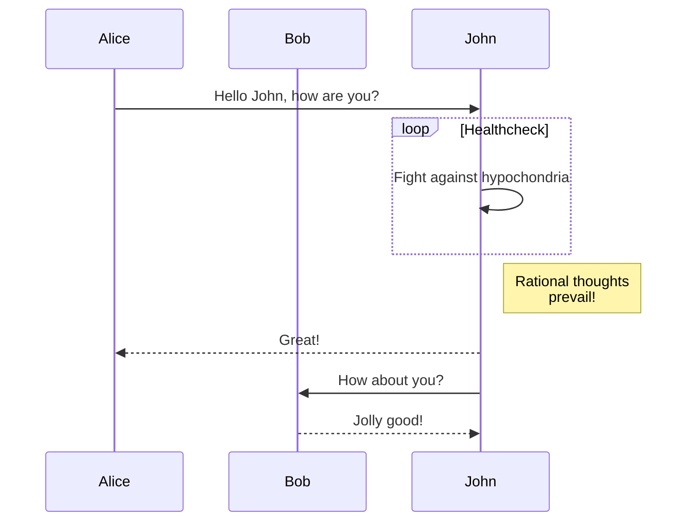

This article offers a sample of basic Markdown syntax that can be used in Hugo content files, also it shows whether basic HTML elements are decorated with CSS in a Hugo theme.
<!--more-->

## Headings

The following HTML `<h1>`—`<h6>` elements represent six levels of section headings. `<h1>` is the highest section level while `<h6>` is the lowest.

# H1
## H2
### H3
#### H4
##### H5
###### H6

## Paragraph

Xerum, quo qui aut unt expliquam qui dolut labo. Aque venitatiusda cum, voluptionse latur sitiae dolessi aut parist aut dollo enim qui voluptate ma dolestendit peritin re plis aut quas inctum laceat est volestemque commosa as cus endigna tectur, offic to cor sequas etum rerum idem sintibus eiur? Quianimin porecus evelectur, cum que nis nust voloribus ratem aut omnimi, sitatur? Quiatem. Nam, omnis sum am facea corem alique molestrunt et eos evelece arcillit ut aut eos eos nus, sin conecerem erum fuga. Ri oditatquam, ad quibus unda veliamenimin cusam et facea ipsamus es exerum sitate dolores editium rerore eost, temped molorro ratiae volorro te reribus dolorer sperchicium faceata tiustia prat.

Itatur? Quiatae cullecum rem ent aut odis in re eossequodi nonsequ idebis ne sapicia is sinveli squiatum, core et que aut hariosam ex eat.

## Blockquotes

The blockquote element represents content that is quoted from another source, optionally with a citation which must be within a `footer` or `cite` element, and optionally with in-line changes such as annotations and abbreviations.

#### Blockquote without attribution

> Tiam, ad mint andaepu dandae nostion secatur sequo quae.
> **Note** that you can use *Markdown syntax* within a blockquote.

#### Blockquote with attribution

> Don't communicate by sharing memory, share memory by communicating.<br>
> — <cite>Rob Pike[^1]</cite>

[^1]: The above quote is excerpted from Rob Pike's [talk](https://www.youtube.com/watch?v=PAAkCSZUG1c) during Gopherfest, November 18, 2015.

## Tables

Tables aren't part of the core Markdown spec, but Hugo supports them out-of-the-box.

   Name | Age
--------|------
    Bob | 27
  Alice | 23

#### Inline Markdown within tables

| Italics   | Bold     | Code   |
| --------  | -------- | ------ |
| *italics* | **bold** | `code` |

## Code Blocks

### Code block with triple backticks

```
def say_hello():
    print("Hello!")
```


```python
def say_hello():
    print("Hello!")
```

### Code block with filename

```python {filename="hello.py"}
def say_hello():
    print("Hello!")
```

### Code block highlight with line numbers

```python {linenos=table,hl_lines=[1, 2],linenostart=1}
def say_hello():
    print("Hello!")

def main():
    say_hello()
```

```python {linenos=table,hl_lines=[1, 2],linenostart=1,filename="hello.py"}
def say_hello():
    print("Hello!")

def main():
    say_hello()
```

## Diagrams

[Mermaid](https://github.com/mermaid-js/mermaid#readme) is a JavaScript based diagramming and charting tool that takes Markdown-inspired text definitions and creates diagrams dynamically in the browser.



## List Types

#### Ordered List

1. First item
2. Second item
3. Third item

#### Unordered List

* List item
* Another item
* And another item

#### Nested list

* Fruit
  * Apple
  * Orange
  * Banana
* Dairy
  * Milk
  * Cheese

## Math

[KaTeX](https://github.com/KaTeX/KaTeX) is a fast math typesetting library for the web. It uses javascript for client-side rendering.

### Inline

```
This $\int\limits_1^\infty \frac{1}{k}\,dk$ is inline.
```

This $\int\limits_1^\infty \frac{1}{k}\,dk$ is inline.

### Separate Paragraph

```
$$f(x) = \int_{-\infty}^\infty \hat f(\xi)\,e^{2 \pi i \xi x} \,d\xi$$
```

$$f(x) = \int_{-\infty}^\infty \hat f(\xi)\,e^{2 \pi i \xi x} \,d\xi$$


## Other Elements — abbr, sub, sup, kbd, mark

<abbr title="Graphics Interchange Format">GIF</abbr> is a bitmap image format.

H<sub>2</sub>O

X<sup>n</sup> + Y<sup>n</sup> = Z<sup>n</sup>

Press <kbd>CTRL</kbd>+<kbd>ALT</kbd>+<kbd>Delete</kbd> to end the session.

Most <mark>salamanders</mark> are nocturnal, and hunt for insects, worms, and other small creatures.
